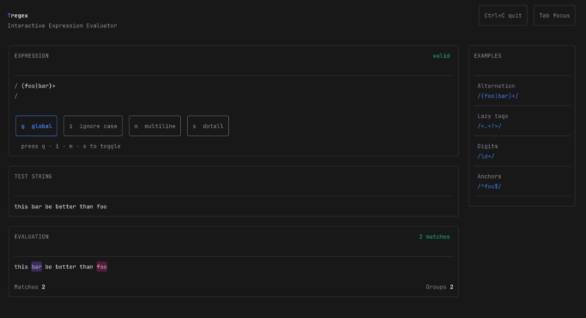

# Tregex

A modern terminal-based regex parser and interactive visualizer built with Go and Bubble Tea. **Tregex** = TUI + regex.



## Features

- **Interactive TUI** - Real-time regex testing with instant visual feedback
- **Full Regex Parser** - Complete lexer and AST parser implementation
- **Syntax Highlighting** - Matched patterns highlighted with distinct colors
- **Capture Groups** - Visual display of captured group contents
- **Pattern Examples** - Built-in example patterns for quick reference


## Supported Regex Syntax


| Syntax                             | Description                                       |
| ---------------------------------- | ------------------------------------------------- |
| `.`                                | Any character                                     |
| `*`, `+`, `?`                      | Quantifiers (zero-or-more, one-or-more, optional) |
| `{n}`, `{n,}`, `{n,m}`             | Range quantifiers                                 |
| `*?`, `+?`, `??`                   | Lazy (non-greedy) quantifiers                     |
| `^`, `$`                           | Start/end anchors                                 |
| `\b`, `\B`                         | Word boundaries                                   |
| `                                  | `                                                 |
| `(...)`                            | Capturing groups                                  |
| `(?:...)`                          | Non-capturing groups                              |
| `[...]`                            | Character classes                                 |
| `[^...]`                           | Negated character classes                         |
| `\d`, `\D`, `\w`, `\W`, `\s`, `\S` | Predefined character classes                      |
| `\1` - `\9`                        | Backreferences                                    |
| `(?=...)`, `(?!...)`               | Lookahead (positive/negative)                     |
| `(?<=...)`, `(?<!...)`             | Lookbehind (positive/negative)                    |


## Installation

### From Source

```bash
git clone https://github.com/yourusername/tregex.git
cd tregex
go build -o tregex ./cmd/tregex
```

### Run Directly

```bash
go run ./cmd/tregex
```

## Usage

1. **Pattern Input** - Enter your regex pattern in the Expression field
2. **Test String** - Type or paste the text you want to match against
3. **View Results** - Matches are highlighted in real-time in the Evaluation panel

### Keyboard Shortcuts


| Key                 | Action                           |
| ------------------- | -------------------------------- |
| `Tab` / `Shift+Tab` | Cycle focus between input fields |
| `Esc`               | Exit application                 |
| `Ctrl+C`            | Exit application                 |


## Project Structure

```
tregex/
├── cmd/
│   └── tregex/             # Application entry point
│       └── main.go
├── pkg/
│   ├── lexer/              # Regex tokenizer
│   │   ├── lexer.go        # Lexer implementation
│   │   └── token.go        # Token type definitions
│   └── parser/             # AST parser
│       ├── parser.go       # Parser implementation
│       ├── ast_nodes.go    # AST node types
│       └── matcher.go      # Pattern matching interface
└── internal/
    └── tui/                # Terminal UI components
        ├── model.go        # Bubble Tea model
        ├── render.go       # Highlight rendering
        └── hooks.go        # Matcher interface
```

## Architecture

### Lexer (`pkg/lexer/`)

Tokenizes regex patterns into discrete tokens:

```go
lexer := lexer.New(`(foo|bar)+`)
tokens, err := lexer.Tokenize()
// Returns: LParen, Char("foo"), Pipe, Char("bar"), RParen, Plus, EOF
```

### Parser (`pkg/parser/`)

Builds an Abstract Syntax Tree from tokens:

```go
parser := parser.NewParser(tokens)
ast, err := parser.Parse()
// Returns: QuantifierNode{Child: GroupNode{Child: AlternationNode{...}}}
```

### Matcher Interface (`internal/tui/hooks.go`)

Pluggable interface for pattern matching:

```go
type Matcher interface {
    MatchRanges(pattern, text string) ([]Range, error)
    Explain(pattern string) (string, error)
}
```

## Dependencies

- [Bubble Tea](https://github.com/charmbracelet/bubbletea) - Terminal UI framework
- [Bubbles](https://github.com/charmbracelet/bubbles) - UI components
- [Lipgloss](https://github.com/charmbracelet/lipgloss) - Styling library

## Requirements

- Go 1.24 or later
- Terminal with ANSI color support

## License

MIT License

## Contributing

1. Fork the repository
2. Create a feature branch (`git checkout -b feature/amazing-feature`)
3. Commit your changes (`git commit -m 'Add amazing feature'`)
4. Push to the branch (`git push origin feature/amazing-feature`)
5. Open a Pull Request

